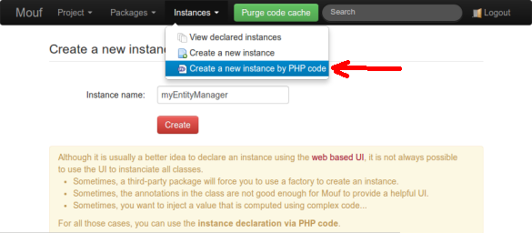
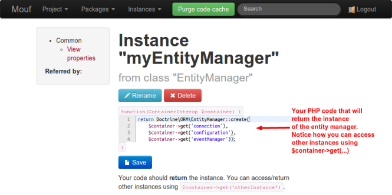
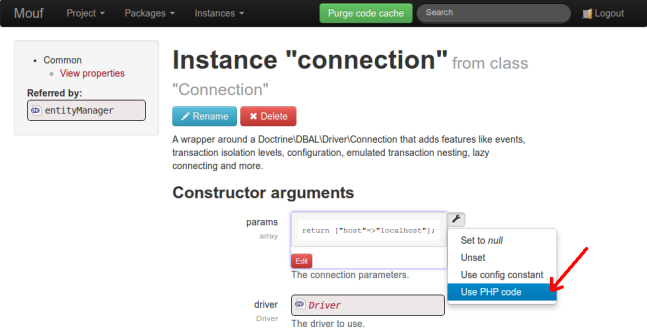
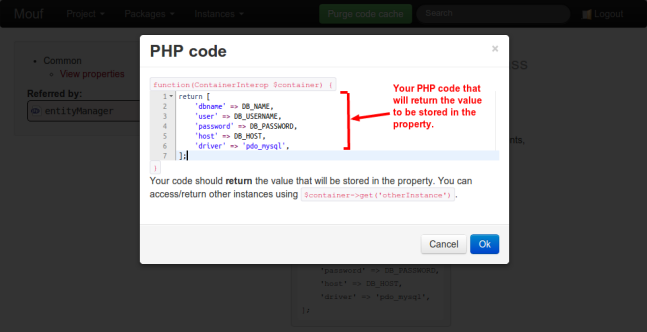

Declaring instances using PHP code
==================================

Common problem faced with Mouf UI
---------------------------------

[Mouf helps you set up your dependency-injection container using a nice graphical user interface.](mouf_di_ui.md)

However, it is not always possible to use the web-based UI to create instances. Here are common problems that
prevent you from using the web-based UI:

- The constructor of the class you want to instantiate is not public
- The setter does not start with "set" or takes more than one parameter
- The annotations regarding the type of object are not correctly written

<div class="alert alert-info">Most of the time, when you write your own code, these problems are easily solved
with minor modifications. However, if you are using a third-party
library, it is not always possible to modify its code.</div>


To solve this problem, Mouf let's you add arbitrary PHP code and inject it into the DI container.
You can injection PHP code:

- [directly into instances](#instancesviacallback)
- [or into properties of existing instances](#propertiesviacallback)

<a id="instancesviacallback"></a>
Declaring instances via callback
--------------------------------

Let's take a sample from a well-known library: Doctrine ORM.

####The EntityManager
```php
class EntityManager implements EntityManagerInterface
{
	// The constructor is protected, therefore cannot be instantiated by Mouf
    protected function __construct(Connection $conn, Configuration $config, EventManager $eventManager)
    {
		...
    }

	// There is a static method that must be used to create the EntityManager
    public static function create($conn, Configuration $config, EventManager $eventManager = null)
    {
		...
        return new EntityManager($conn, $config, $conn->getEventManager());
    }

}
```

In this sample, the only way to get an instance of an entity manager is to use the `create` static method, since
the constuctor is protected.

Start by clicking the _Instances > Create a new instance by PHP code_ menu.



Give a name to your instance (in our case, we will call it "myEntityManager").
The instance screen is very different from the "normal" instance screen. You can indeed directly type
PHP code in that screen:



The PHP code you type is located in a PHP callback that takes one parameter: the container (by default, this
is an instance of the `MoufManager` class, but you should only assume it is an instance compatible with
`ContainerInterface`).
The code of the callback you are typing will return the instance. Therefore, do not forget the `return` keyword
at the end of the method.

You can save your code at any moment using "Ctrl-S" or the "Save" button.
When you save the code, it will be automatically executed. This way, Mouf will know the type of your
instance.

As much as possible, please avoid putting complex code in an instance defined by callback.
You should try to keep the code as simple as possible and you should avoid costly calls (like DB requests...)

<a id="propertiesviacallback"></a>
Declaring properties via callback
---------------------------------

Sometimes, there is nothing stopping you from creating a perfectly valid instance using a public constructor
and still, you can face problems with the Mouf UI.

Here is a sample with [Doctrine DBAL](http://www.doctrine-project.org/projects/dbal.html) and the 
[`Connection` class](https://github.com/doctrine/dbal/blob/master/lib/Doctrine/DBAL/Connection.php#L200)

Have a look at the constructor of this class:

```php
namespace Doctrine\DBAL;

class Connection implements DriverConnection
{
    ...
    
    /**
     * @param array                              $params       The connection parameters.
     * @param \Doctrine\DBAL\Driver              $driver       The driver to use.
     * @param \Doctrine\DBAL\Configuration|null  $config       The configuration, optional.
     * @param \Doctrine\Common\EventManager|null $eventManager The event manager, optional.
     * @throws \Doctrine\DBAL\DBALException
     */
    public function __construct(array $params, Driver $driver, Configuration $config = null,
            EventManager $eventManager = null)
    {
        ...
    }
    
    ...

}
```

Facing such a constructor, Mouf is having a problem. The first argument of the constructor (`$params`)
is an `array`. We don't know anything about this array. Is this an array of strings? An array of objects?
Is this an associative array or an indexed array? Mouf has not enough information to guess and therefore, the
web UI is useless...

Hopefully, we can use the 'Use PHP code' menu of each property to define custom PHP code that can fill the property.



Now, you can type pure PHP code that will fille the property:



Just like in the previous chapter, the PHP code you type is located in a PHP callback that takes one parameter: 
the container.
The code of the callback you are typing can return any value to be stored in the property (it can
by an array, a string, an integer, an object, a resource... what you want!). Do not forget the `return` keyword
at the end of the method.

You can save your code at any moment using "Ctrl-S" or the "Save" button.
When you save the code, a syntax analysis is performed by Mouf to check this is valid PHP, and an error will
be displayed if a syntax error is detected.

As much as possible, please avoid putting complex code in a property declared by callback.
You should try to keep the code as simple as possible and you should avoid costly calls (like DB requests...)
