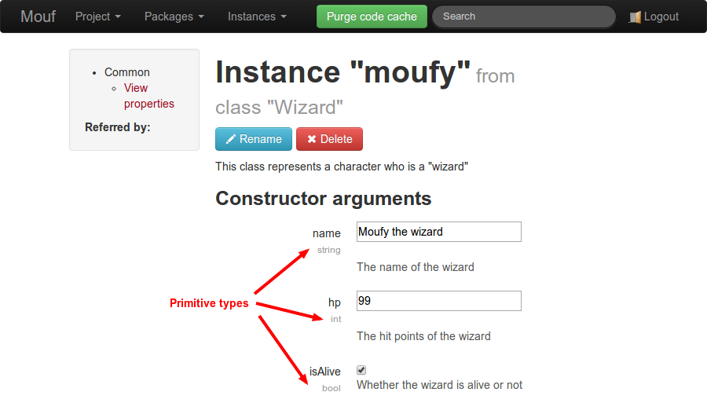

Mouf's supported types
======================

Supported injection techniques
------------------------------

When you work with Mouf, you can inject dependencies or parameters in your instances. If you want
to [use Mouf UI for dependency injection](mouf_di_ui.md), you can use 3 types of injection:

- **Constructor arguments**: any argument in a constructor can be configured in Mouf (actually, any
  argument that is not compulsory MUST be configured in Mouf, otherwise, Mouf won't be able to
  instantiate the object)
- **Public properties**: any public property of a class can be edited using Mouf
- **Setters**: any setter (a function with one parameter starting with the 3 letters "set") can be
  called by Mouf.

If you are using *constructor arguments* or *setters*, you can rely on [PHP type hinting](http://php.net/manual/en/language.oop5.typehinting.php).

For instance:

```php
public function __construct(LoggerInterface $logger) {
	$this->logger = $logger;
}

public function setLogger(LoggerInterface $logger) {
	$this->logger = $logger;
}
```

Mouf will know that those constructor and setter are expecting a `LoggerInterface` property.

However, type hinting is limited in PHP. If you have more advanced needs, you can use annotations to help you.
Here are 3 samples:

```php
/**
 * @param LoggerInterface $logger
 */
public function __construct($logger) {
	$this->logger = $logger;
}
```

```php
/**
 * @param LoggerInterface $logger
 */
public function setLogger(LoggerInterface $logger) {
	$this->logger = $logger;
}
```

```php
/**
 * @var LoggerInterface
 */
public $logger;
```


Supported types
---------------

There 4 kind of supported types:

- Classes and interfaces
- Primitive types
- Arrays (and associative arrays)
- Mixed types

Note: if you are using a third party library th at requires injecting a type that is not supported,
you can always fallback to [injecting values via PHP code](declare_instance_via_php_code.md);

###Classes and interfaces

We already saw that classes and interfaces can be used as types in the example above.

In the Mouf user interface, these properties will be displayed like this:


###Primitive types

Mouf supports those primitive types:

- string
- char
- bool
- boolean
- int
- integer
- double
- float
- real
- mixed
- number

If your type is one of those, you will be able to input text directly in the property in Mouf UI.
Note that there is a special behaviour for "bool" and "boolean". They are rendered as a checkbox in Mouf UI.

For instance:

```php
/**
 * @var string
 */
public $user;

/**
 * @var int
 */
public $port;

/**
 * @var bool
 */
public $isActive;
```

will be rendered this way:




###Arrays

You can also inject arrays into properties.
You can use arrays of primitive types or arrays of objects (but you cannot mix both).

There are 2 ways to write arrays: using bracket or the **array** keyword.

Here are a bunch of samples: 

- `string[]` : an array of strings
- `array<string>` : an array of strings
- `LoggerInterface[]` : an array of objects implementing LoggerInterface
- `array<LoggerInterface>` : an array of objects implementing LoggerInterface
- `array<string,string>` : an associative array of strings
- `array<string,LoggerInterface>` : an associative array of objects implementing LoggerInterface

- **Unsupported**: `array`. Because Mouf does not know if this is an array of primitive or an array of objects.

As you can notice, associative arrays (or maps) can only be achieved using the **array** notation.

Below is a screenshot showing reprensentations of various arrays in Mouf:


<div class="alert">If you are trying to create an instance of a class provided by
 a third party library, it is likely that you will
have at some point a property whose type is <code>array</code>. Mouf has no clue what can be injected in an
array (is it an array of strings? of objects? a map? In this case, you can still inject the value
you want by using the <a href="declare_instance_via_php_code.md">inject property by PHP code</a> 
option that will let you type some PHP code to fill the property.</div>


###Mixed types

Mouf does not support the **mixed** keyword.
However, you can use a pipe to declare that a property can have many different types.

For instance:

- `string|ValueInterface|array<ValueInterface>` is a valid type

Using the UI, you can choose the type you want to inject by clicking on it.
Below is a sample screenshot:


