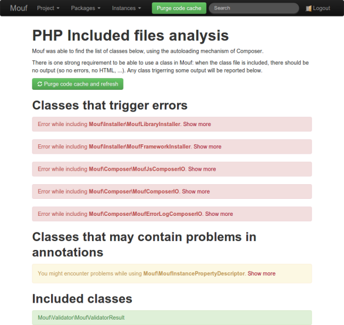

Troubleshooting guide
=====================

Developer's life is not a long and winding road. You will encounter bumps along the way and you 
need to have good tools to help you get away with your problems.

Mouf does its fair share helping you pinpoint any problem or bug that might arise from your code.

When facing a problem, here is the typical workflow you should follow:

1. Purge the **code cache** (green button) and the **cache** (red button)
2. Check Mouf's status page (menu **Project** > **Mouf status**) and try to solve any problem displayed
3. Still having a problem? Check the classes analyzis (menu **Project** > **Analyze classes**)
   This page displays the list of classes Mouf cannot load successfully, along a nice error message.
   It is common for Mouf to fail loading a number of classes. Check that the class you are working 
   on is not one of them.

Do not try to fix all problems in the classes analyzis page. This is not possible,
in particular if you are using third pary packages. Instead, focus on your classes and make sure your classes
have no errors.

###Still having a problem?

If your problem is related to installing Mouf, or seems environment related, check the <a href="troubleshooting_install.md" class="btn">Troubleshooting 
installation guide &gt;</a>.

If your problem is related to Mouf, <a href="https://github.com/thecodingmachine/mouf/issues?state=open" class="btn btn-primary">Open an issue on Github &gt;</a>.
